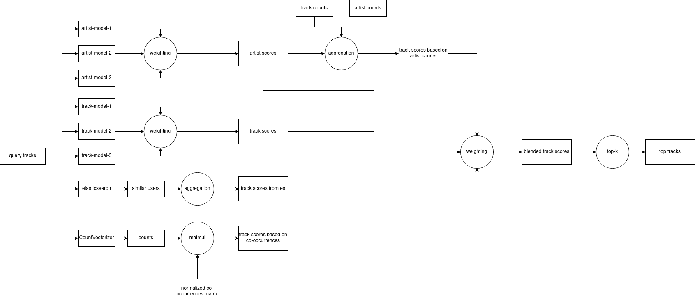

3rd place solution in Yandex Cup 2022 - ML RecSys.

* load [data](https://disk.yandex.ru/d/v_Tihf04KPDnzw)
* load [models](https://disk.yandex.ru/d/A4aPblAnXUtBGg)
* put data in `/data`, models - in `/models`
* run inference script:
    ```
    cd bin
    bash predict_final.sh
    ```
* output will be saved to `/outputs`

About configurations (see `experiment` in `predict_final.sh`):
* `"inference/ensemble"` - final ensemble
* `"inference/final"` - setup for final submission (public: 0.086059; private: 0.086)
* `"inference/post_final"` - final submission, where tracks vocab size in one of the approaches 50k -> 483k (public: 0.087251; private: ?). 
Have finished this experiment only after deadline, unfortunately :(
* `"inference/valid"` - validation setup, where 1) last track is removed from likes history; 2) first 10k users from test file are considered
* `"inference/test"` - submission setup, where whole likes history and all users are considered.

Approximate inference time in `"inference/test"` setup:
* `"inference/final"` - 3 hours on Tesla V100
* `"inference/post_final"` - 8 hours on Tesla V100

Final ensemble looks as follows:

